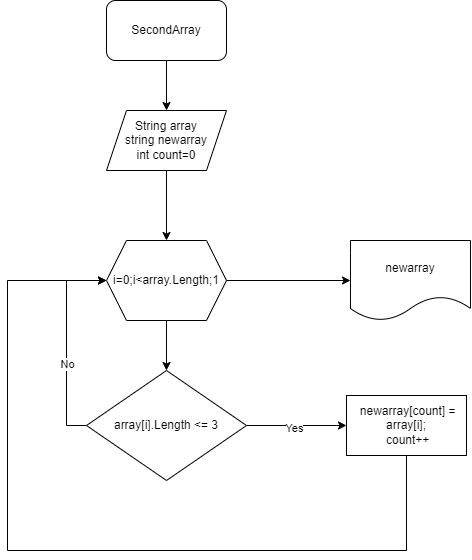

**Задача: Написать программу, которая из имеющегося массива строк формирует новый массив из строк, длина которых меньше, либо равна 3 символам. Первоначальный массив можно ввести с клавиатуры, либо задать на старте выполнения алгоритма. При решении не рекомендуется пользоваться коллекциями, лучше обойтись исключительно массивами.**

*Решение*

1. Объявляю два массива. Первый исходный с заданными элементами и второй такого же размера.

2. Задала метод, в котором проходит проверка длинны каждого элемента (меньше, либо равна 3).

3. Если элемент меньше, либо равен 3, то он попадает в новый массив, а переменная count увеличивается на один, до полной проверки исходного массива.
4. Задала метод по выводу нового массива.
5. Обращаюсь к методам создания нового массива и выводу нового массива. 

**Блок-схема:**
В файле block.drawio.png находится блок-схема

**Программа**
Код находится в файле Program.cs

